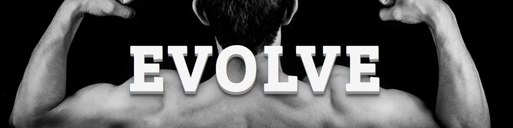

# Table of Contents

1. Overview

2. User Experience Design (UX)
    - User
    - Structure
    - Design
        - Colour Scheme
        - Typography
        - Imagery
        - Wireframes
        - Future Releases

3. Features

4. Technologies

5. Testing
    - Test Strategy
    - Summary
    - High Level Test Cases
    - Out of Scope
    - Test Results
    - Testing Issues

6. Deployment

7. Credits

# Overview

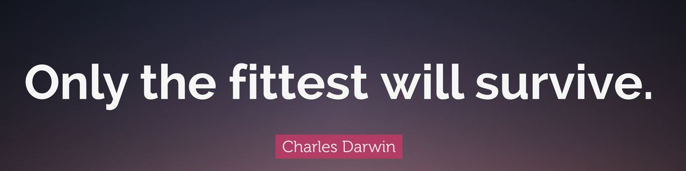

The Evolve gym website was designed with a primary purpose of a business website to showcase the gym and get membership. It's goal, is to acheive this by providing a positive user experence where the user has a 'one-stop shop' for everthing required to set and acheive their goals, state of the art Evolve gym, enthusiastic staff, science based workouts, diet and nutritional advise. Providing this additional information gives the site 'stickyness' so that the user will bookmark and return to the site may times for the content increaseing the possibilty of signing up!

The website is fully responsive and can be viewed across all devices.

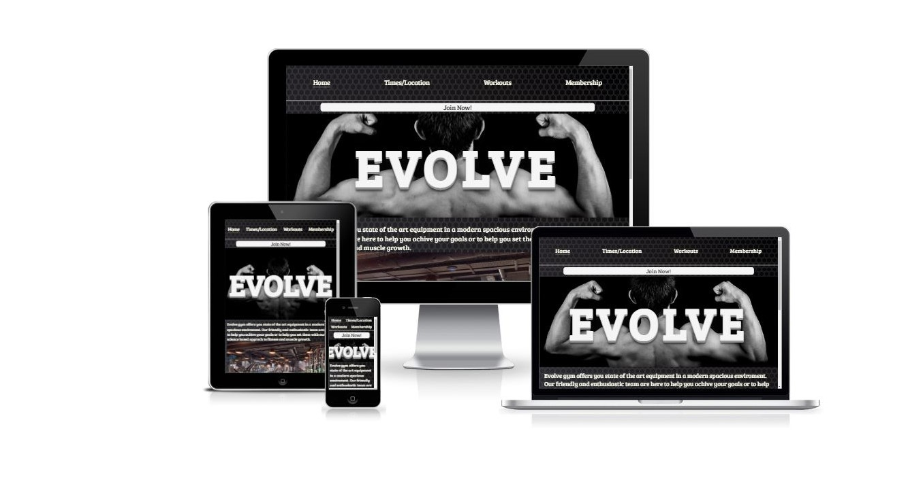

Click [here](https://gelwood7.github.io/evolve-gym/) for the live website.

# User Experience Design (UX)

## User Stories

### First Time User
- As a first time user, I want to know this is a fittness website.
- As a first time user, I want to navigate easily through the site.
- As a first time user, I want to see what the gym looks like.
- As a first time user, I want to know the opening times, cost and location.
- As a first time user, I want to be able to make someone contact me about membership.  

### Returning User
- As a returning user, I want to avail of the science based workouts, diet and nutritional content.
- As a returning user, I want to join the gym.

## Structure

- The layout of the pages will be unclutered and intuitive as to what each page and section is about.
- Elements such as images and text will be reduced in size according to viewport to ensure readability and easy of navigation on mobile devices.
- The navigation bar will be visable on all pages.
- The content of the pages will:
    1. Showcase what the gym looks like and equipment available.
    2. Show the user the opening times and location.
    3. Present science based workouts for different muscle grups.
    4. Provide video, text and links to information on diet, nutrition and supplements (may not be included in inital release).
    5. Show the membership types and costs.
    6. Allow the user to submit a form with name and email address to be contacted by a menmber of the Evolve team.
    7. Show the user the form has been received, thank them and confirm they will be contacted ASAP.

## Design

### Colour Scheme  
    I choose a dark color scheme as I felt it fit with the image of the gym and is also very clean and distintive. I decided on a font color of ivory to really set off the text on the darker background. The hero image was them selected in black and white format to follow the scheme, given this dark hero image I wanted text that really caught the eye. I chose hex #f5f5f5 for the text color and first used Charles Darwins icon of the evolution of man, but as this was too clutered I went with a shadowing on the text from https://codepen.io/ryandsouza13/pen/yEBJQV which gave the text depth. The shadow is a combination of hex #919191 and rgba(16,16,16) with different levels of opacity from 0.2 to 0.4. This color scheme was then appied throughout the site.

### Typography
    The font for the site is Bree Serif, this was the right choice as it is a friendly italic which brings a comfort and warmth to many straight line on the site. It work well in both upper and lower case adn is clearly legable. The hero image text shows this in large uppercase font witha shaddow effect giving it great prominence.

### Imagery
    The imagery was chossen in keeping with teh colour sheme and to be visually descriptive and figurative, while reamining simple and shows a very spacious well equiped gym.

###- Wireframes  

    1.  Home Page  
        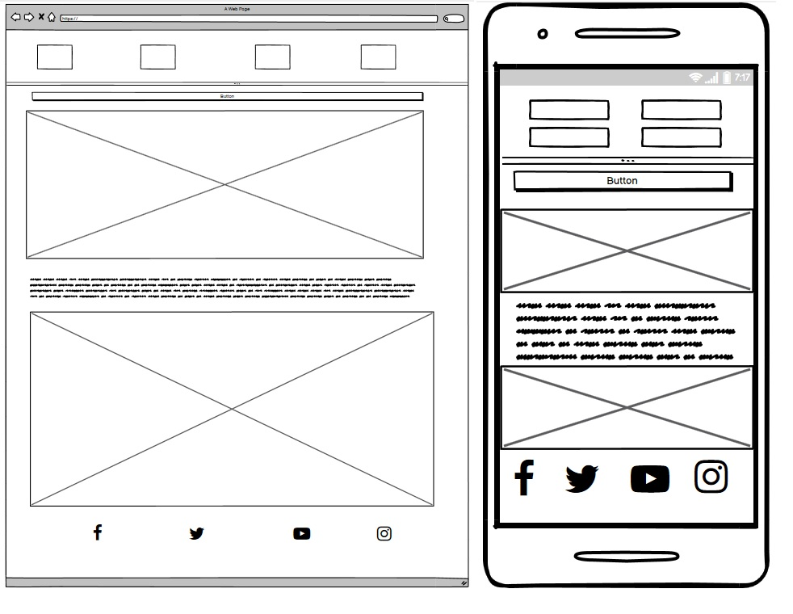

    2.  Opening Hours and Location  
        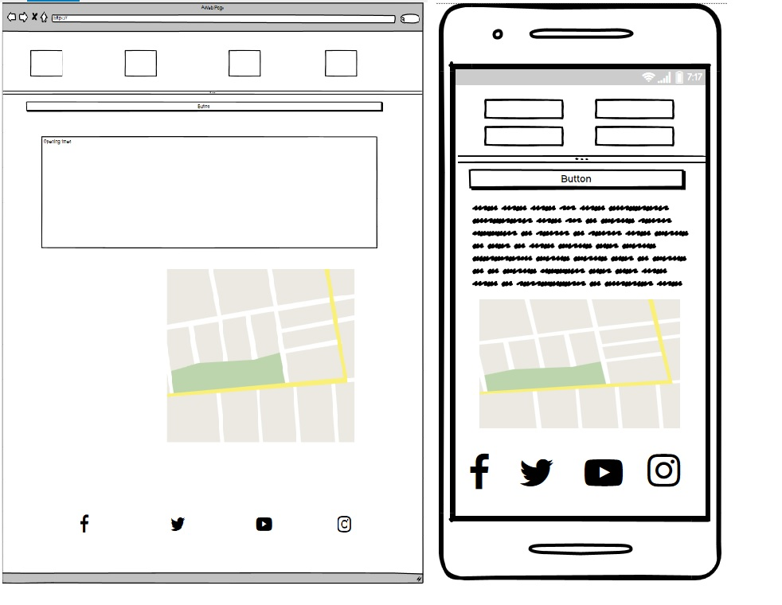
    
    3.  Workouts  
        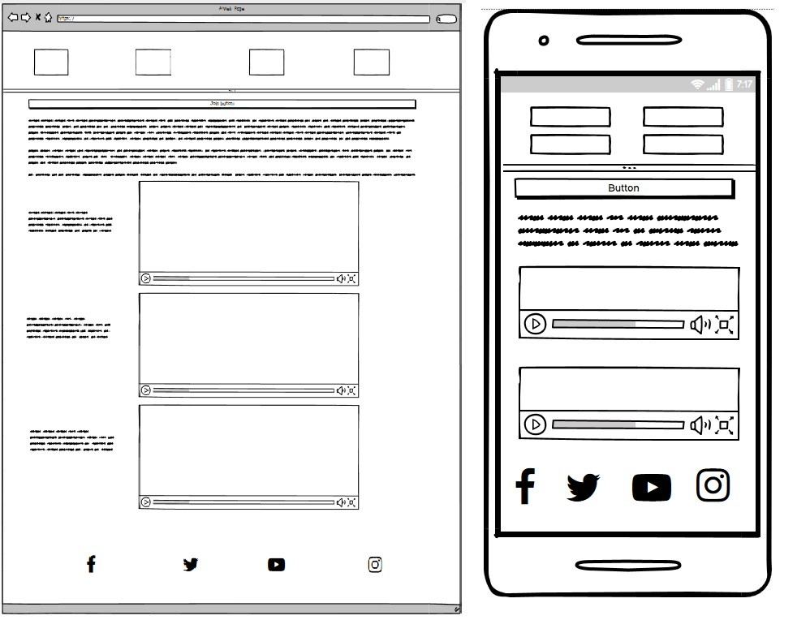

    4.  Diet and Nutrition (Next Release)  
        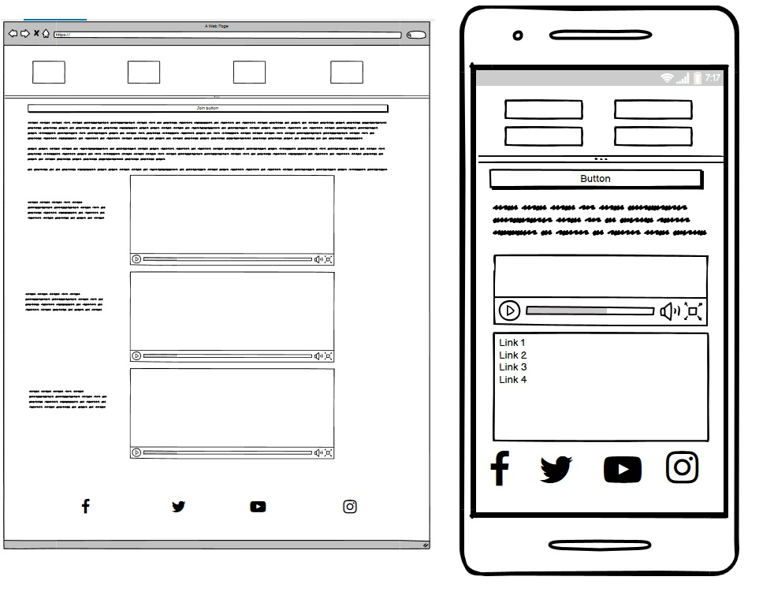
    
    5.  Sign Up  
        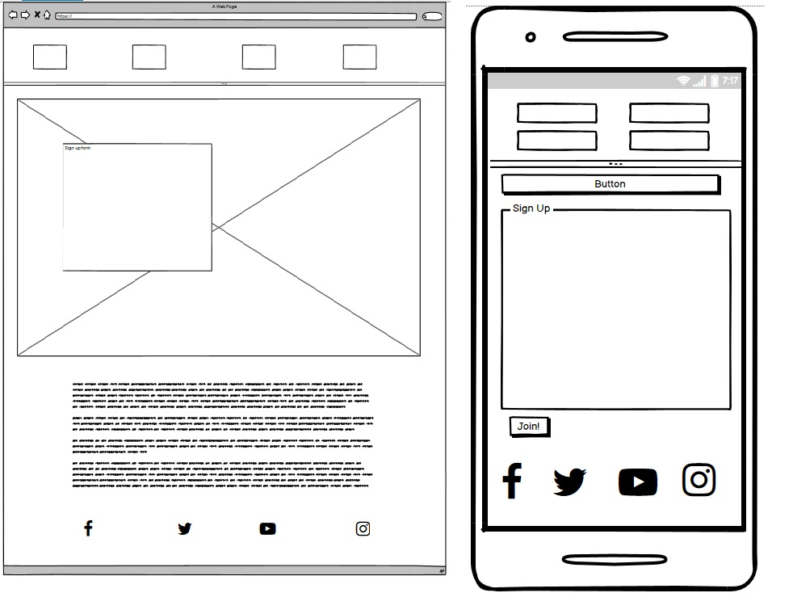

- Future Releases

## Features

## Technologies

## Testing
- Strategy
- Summary
- Test Cases
- Out of Scope
- Test Results  

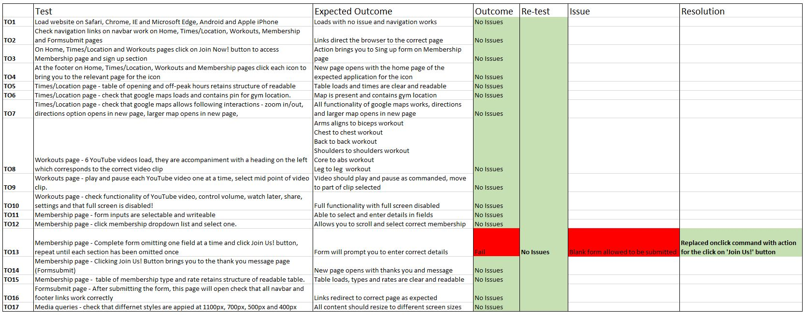

Lighthouse Results - Desktop  
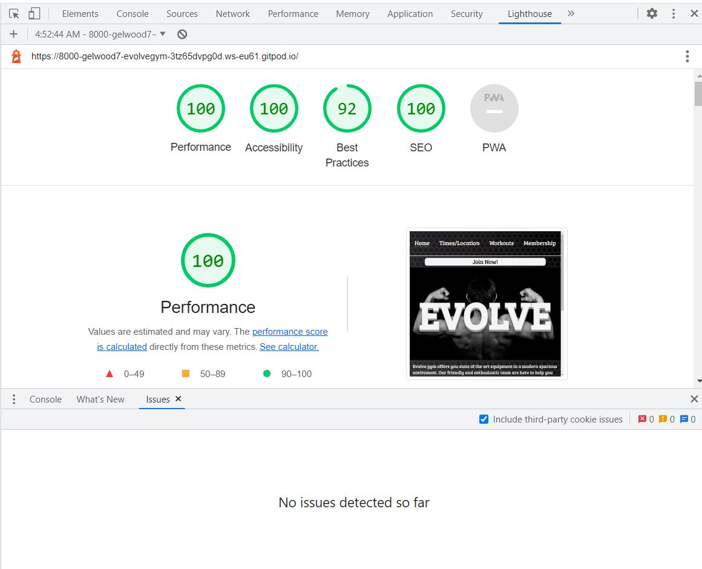

Lighthouse Results - Mobile Phone  
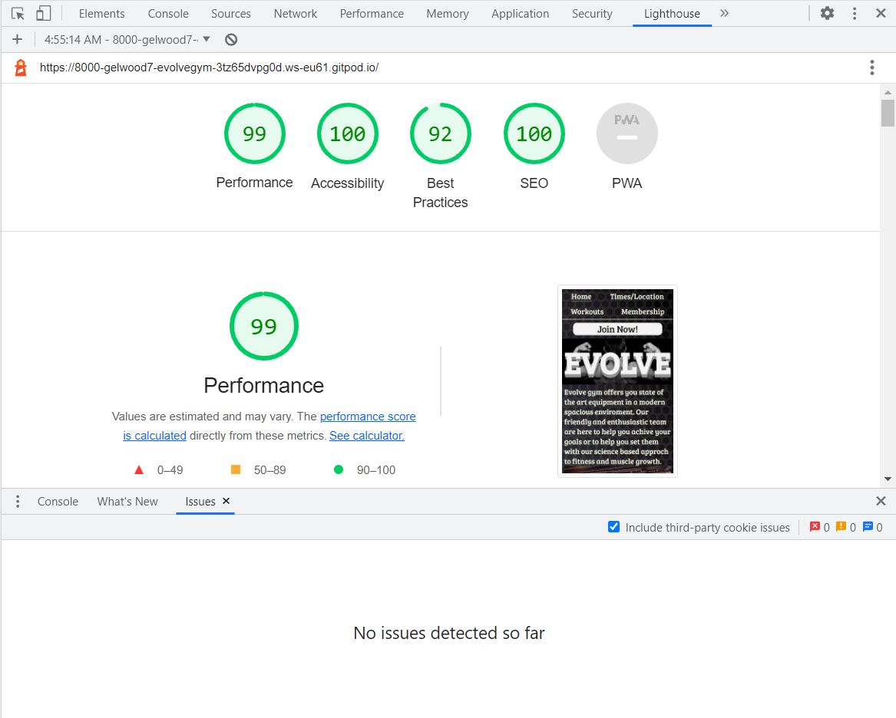

W3 HTML Valdation Result  
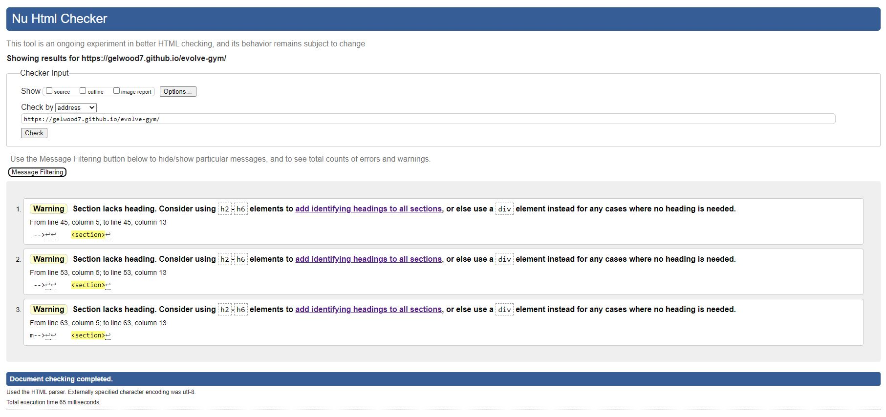

W3 CSS Valdation Result  
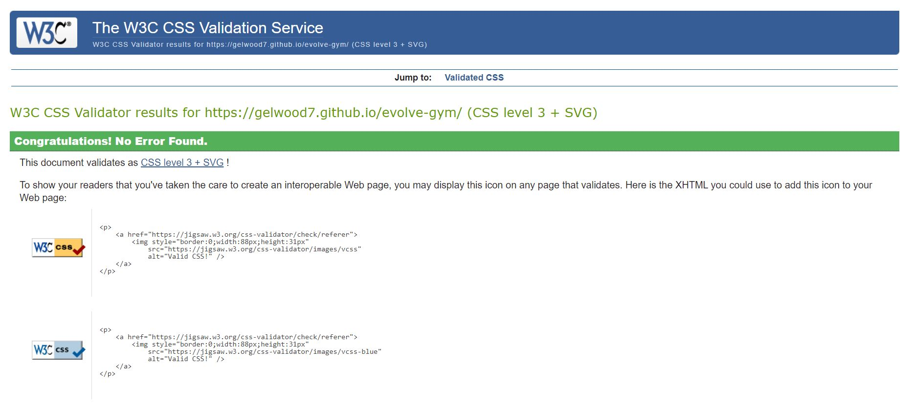

- Testing Issues & Resolution

## Deployment

git 

## Credits